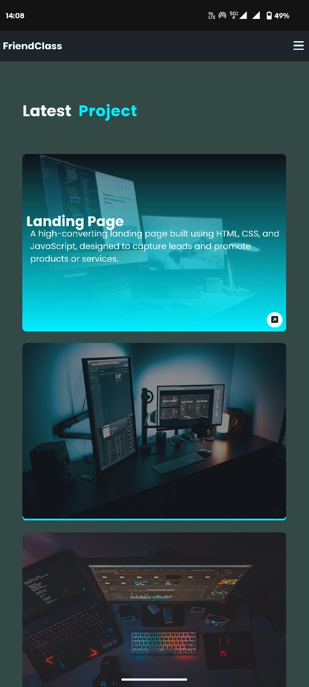

# 💼  Portfolio Website
A modern and responsive personal portfolio website to showcase Devendra Kumar's skills, projects, and services. Built using HTML, CSS, and JavaScript, the site is optimized for all devices and features engaging animations, smooth scrolling, and dynamic typing effects.

## 🌐 Live Demo
🔗 [Visit](https://devendrakumar-jaj.github.io/PORTFOLIO-WEB/)

## Click Or Hover mouse to get




## 📁 Project Structure

```
📦 Portfolio Website
├── index.html            → Main portfolio webpage
├── comming.html          → Placeholder page for "coming soon" features
├── style.css             → All styling for the website
├── script.js             → JavaScript logic for interactivity
└── images/               → Folder for all project images and assets
```

## ✨ Features
- ✅ Responsive Design — Works seamlessly on mobile, tablet, and desktop.

- ✅ Interactive Navigation — Hamburger menu toggle for smaller screens.

- ✅ Animated UI — Scroll-based animations using ScrollReveal.js.

- ✅ Dynamic Typing Text — Profession titles animated with Typed.js.

- ✅ Contact Form UI — Responsive input boxes with mobile validation (no backend).

- ✅ Service & Project Cards — Blurred reveal effect with hover interactions.

- ✅ "Coming Soon" Pages — For under-construction features like CV download.

## 🛠️ Tech Stack
- HTML5

- CSS3

- JavaScript (ES6)

- Font Awesome

- Typed.js

- ScrollReveal.js


## 🚀 Getting Started
To run this project locally:

1. Clone the repository:

```
git clone https://github.com/DevendraKumar-JAJ/PORTFOLIO-WEB.git
```

2. Navigate to the folder:

```
cd PORTFOLLIO-WEB
```

3. Open in your browser:

```
Open index.html with your preferred browser.
or 
Open with liveserver
``` 

## 🧪 Future Improvements
✅ Add real CV download functionality

✅ Integrate backend for contact form

✅ Host personal blog dynamically (WordPress or React-based)

✅ Add more real-world project links

✅ Improve accessibility (ARIA, contrast, alt tags)

## 🤔 What You Should Fix

| Issue	| Fix |
|-------|-----|
| No ARIA roles or landmarks |	Add role, aria-label, aria-labelledby
| Missing alt text |	Add descriptive alt attributes
| No form labels | 	Add <label for=""> and visually-hidden class
| Keyboard navigation |	Add :focus styles
| Unclear link purpose |	Add aria-label or use more descriptive text
| Use of <a> as buttons	| Consider semantic \<button> or add ARIA roles

## 😑 Examples 

> ✅ 1. Add ARIA Roles and Landmarks

Add meaningful ARIA roles and semantic landmarks to enhance screen reader support.

```
<!-- Update header -->
<header class="header" role="banner">

<!-- Update nav -->
<nav class="navbar" role="navigation" aria-label="Main Navigation">

<!-- For section tags, use aria-label or aria-labelledby -->
<section class="home" id="home" aria-labelledby="home-heading">
  <h1 id="home-heading" class="visually-hidden">Home</h1>

<!-- Footer -->
<footer class="footer" role="contentinfo">
```

>✅ 2. Add alt Texts for All Images

Provide meaningful alt attributes for all images.

```

```

>✅ 3. Form Accessibility Improvements

🔧 Add labels for inputs:

```
<form action="#" aria-labelledby="contact-heading">
  <label for="fullname" class="visually-hidden">Full Name</label>
  <input type="text" id="fullname" name="fullname" placeholder="Full Name" required />
```

>✅ 4. Keyboard Navigation

Your site appears to be keyboard-friendly. But make sure:

All interactive elements (nav links, buttons, forms) are focusable.

Add :focus styles for clarity.

>✅ 6. Use Descriptive Link Text

Avoid using links like "Read More" or "Click here" alone.

🔧 Instead, do:
```
<a href="./comming.html" class="btn" aria-label="Read more about Full Stack Web Development">Read More</a>
```

> ✅ 7. Use \<button> Instead of \<a> for Non-Links (Optional)

If you're using \<a> tags for things like toggles or buttons (e.g. navbar toggle), it's better to use \<button> for semantics. If not feasible, ensure role="button" and tabindex="0" are used.


## 📝 License
This project is for educational and personal use only. You are free to fork and customize for your own portfolio. [MIT](https://github.com/DevendraKumar-JAJ/PORTFOLIO-WEB?tab=MIT-1-ov-file)

